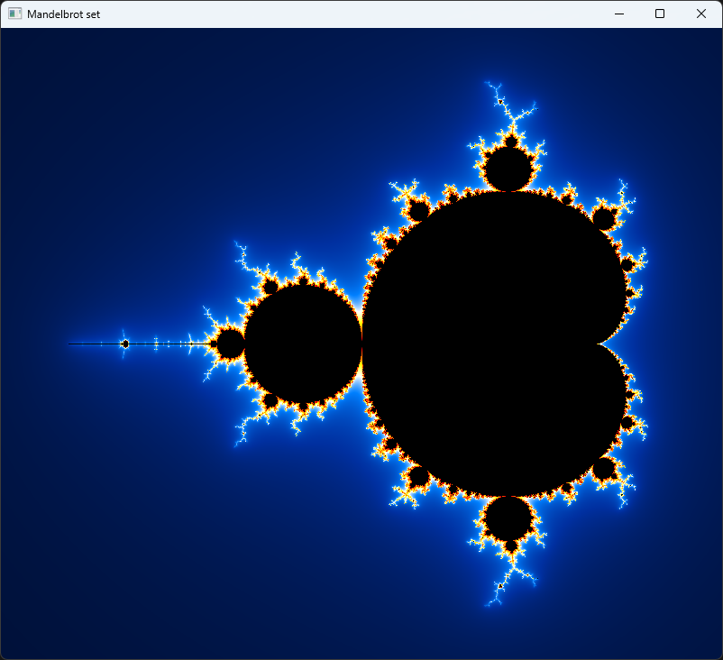
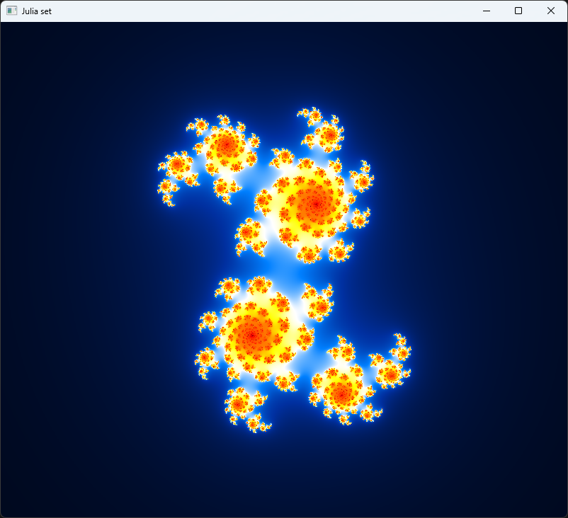
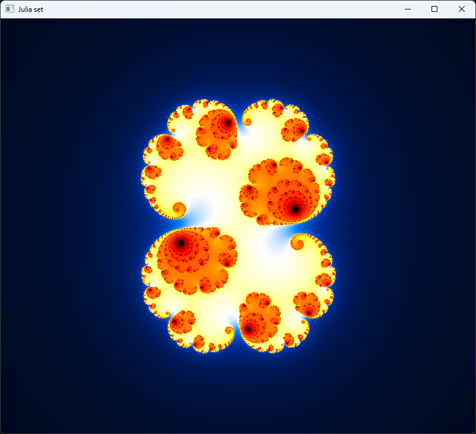

# Mandelbrot

## Description

This is a simple [Mandelbrot](https://en.wikipedia.org/wiki/Mandelbrot_set)
and [Julia](https://en.wikipedia.org/wiki/Julia_set) set viewer written in C# using
the [OpenCVSharp](https://www.nuget.org/packages/OpenCvSharp4.Windows) library.

## Controls:

- **Left click and drag**: Move the image. _(The image is re-rendered when the mouse is released.)_
- **Ctrl + left click**: Open a new window of the Julia set, with the clicked point as the constant.
- **Ctrl + scroll**: Zoom in and out of the fractal at the mouse position.
- **F5**: Reset the fractal to its default state.
- **+** _(Numpad)_: Zoom in at the center.
- **-** _(Numpad)_: Zoom out at the center.
- **Esc**: Close the window.

## Screenshots

